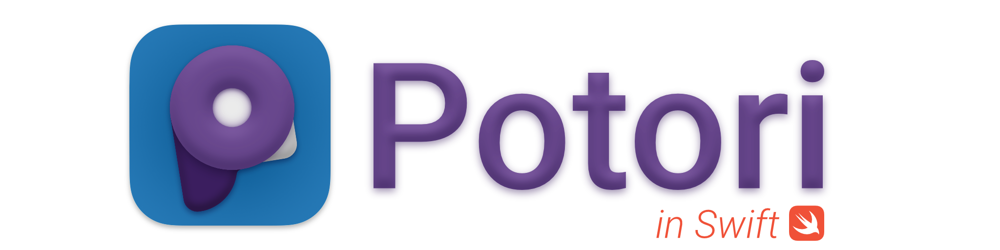

# 

  

  

## Descriptions
An app to manage Ingress nominations from Gmail inbox, available for macOS and iOS.

- Built with SwiftUI
- Provide widgets
- Sync with Google Drive

This is the Swift implementation of [the web app](https://github.com/lucka-me/potori).

### Future Style
We are working on the next major release with new features and enhancements, the code is maintainced in `next` branch.

- Replace SwiftUI `Map` with [Mapbox Maps SDK for iOS](https://github.com/mapbox/mapbox-maps-ios) and MapKit for macOS with more powerful features
- Implement existing methods with concurrency (`await` and `async`) of Swift 5.5
- Improve UI with the latest SwiftUI

## Requirements
- Xcode 13+
- macOS 12+
- iOS 15+

## Build & Run
1. Clone or download the repository
2. Open `Potori.xcodeproj`
3. Change the Team, Bundle Identifiers and App Groups to valid ones
4. Choose the target and connect your device if necessary
5.  `⌘ R`

## Related Repositories
- [lucka-me/potori](https://github.com/lucka-me/potori): The original web app
- [lucka-me/potori-docs](https://github.com/lucka-me/potori-docs): Documents of Potori
- [lucka-me/potori-umi](https://github.com/lucka-me/potori-umi): Status and reasons data used in Potori

## License
The source code are [licensed under MIT](./LICENSE).

Please notice that the Client ID included in the source code is owned by [Lucka](https://github.com/lucka-me) and **ONLY** for public useage in the app.

This project is NOT affiliated to Ingress or Niantic.
